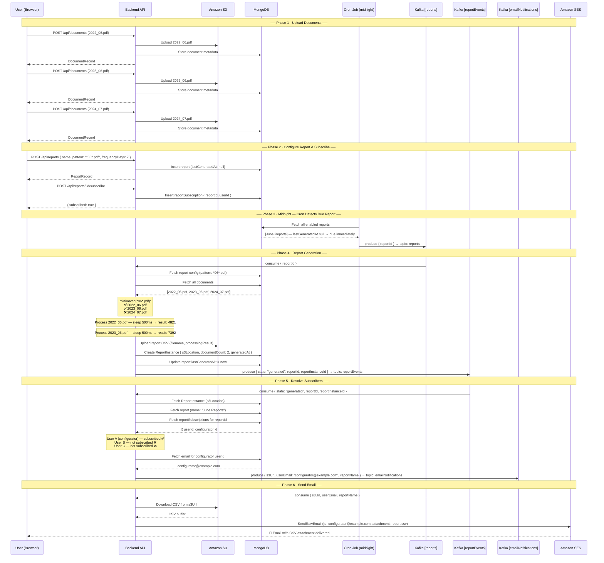

# Report Generation Flow

End-to-end sequence diagram covering document upload, report configuration, cron-triggered generation, Kafka message passing, and email delivery via SES.

```mermaid
sequenceDiagram
    participant User as User (Browser)
    participant API as Backend API
    participant S3 as Amazon S3
    participant DB as MongoDB
    participant Cron as Cron Job (midnight)
    participant KR as Kafka [reports]
    participant KE as Kafka [reportEvents]
    participant KN as Kafka [emailNotifications]
    participant SES as Amazon SES

    Note over User,SES: ── Phase 1 · Upload Documents ──

    User->>API: POST /api/documents (2022_06.pdf)
    API->>S3: Upload 2022_06.pdf
    API->>DB: Store document metadata
    API-->>User: DocumentRecord

    User->>API: POST /api/documents (2023_06.pdf)
    API->>S3: Upload 2023_06.pdf
    API->>DB: Store document metadata
    API-->>User: DocumentRecord

    User->>API: POST /api/documents (2024_07.pdf)
    API->>S3: Upload 2024_07.pdf
    API->>DB: Store document metadata
    API-->>User: DocumentRecord

    Note over User,SES: ── Phase 2 · Configure Report & Subscribe ──

    User->>API: POST /api/reports { name, pattern: "*06*.pdf", frequencyDays: 7 }
    API->>DB: Insert report (lastGeneratedAt: null)
    API-->>User: ReportRecord

    User->>API: POST /api/reports/:id/subscribe
    API->>DB: Insert reportSubscription { reportId, userId }
    API-->>User: { subscribed: true }

    Note over User,SES: ── Phase 3 · Midnight — Cron Detects Due Report ──

    Cron->>DB: Fetch all enabled reports
    DB-->>Cron: [June Reports] — lastGeneratedAt null → due immediately
    Cron->>KR: produce { reportId } → topic: reports

    Note over User,SES: ── Phase 4 · Report Generation ──

    KR->>API: consume { reportId }
    API->>DB: Fetch report config (pattern: *06*.pdf)
    API->>DB: Fetch all documents
    DB-->>API: [2022_06.pdf, 2023_06.pdf, 2024_07.pdf]
    Note over API: minimatch(*06*.pdf):<br/>✅ 2022_06.pdf<br/>✅ 2023_06.pdf<br/>❌ 2024_07.pdf
    Note over API: Process 2022_06.pdf — sleep 500ms → result: 4821
    Note over API: Process 2023_06.pdf — sleep 500ms → result: 7392
    API->>S3: Upload report CSV (filename, processingResult)
    API->>DB: Create ReportInstance { s3Location, documentCount: 2, generatedAt }
    API->>DB: Update report.lastGeneratedAt = now
    API->>KE: produce { state: "generated", reportId, reportInstanceId } → topic: reportEvents

    Note over User,SES: ── Phase 5 · Resolve Subscribers ──

    KE->>API: consume { state: "generated", reportId, reportInstanceId }
    API->>DB: Fetch ReportInstance (s3Location)
    API->>DB: Fetch report (name: "June Reports")
    API->>DB: Fetch reportSubscriptions for reportId
    DB-->>API: [{ userId: configurator }]
    Note over API: User A (configurator) — subscribed ✅<br/>User B — not subscribed ❌<br/>User C — not subscribed ❌
    API->>DB: Fetch email for configurator userId
    DB-->>API: configurator@example.com
    API->>KN: produce { s3Url, userEmail: "configurator@example.com", reportName } → topic: emailNotifications

    Note over User,SES: ── Phase 6 · Send Email ──

    KN->>API: consume { s3Url, userEmail, reportName }
    API->>S3: Download CSV from s3Url
    S3-->>API: CSV buffer
    API->>SES: SendRawEmail (to: configurator@example.com, attachment: report.csv)
    SES-->>User: 📧 Email with CSV attachment delivered
```
